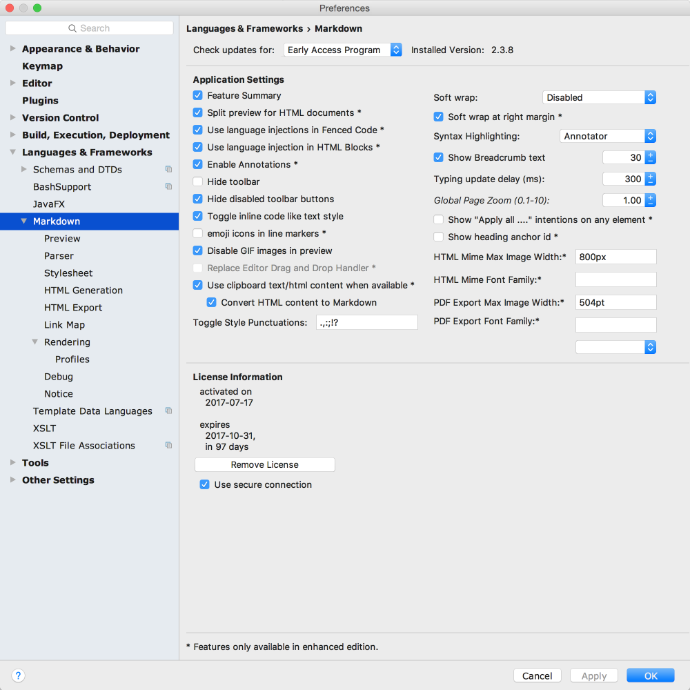
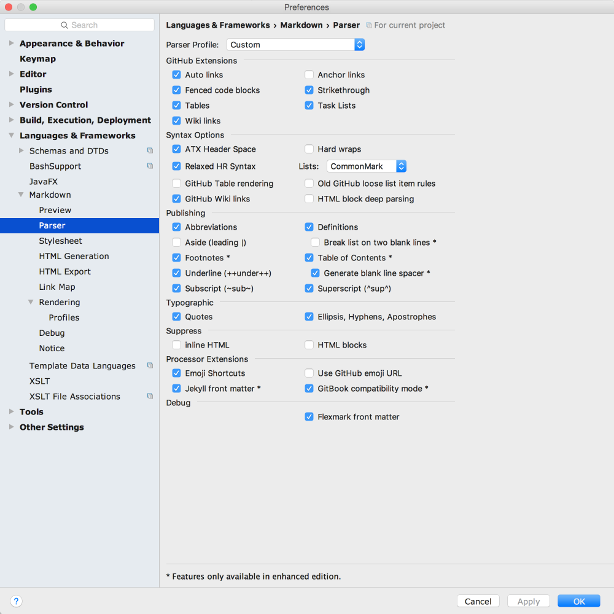
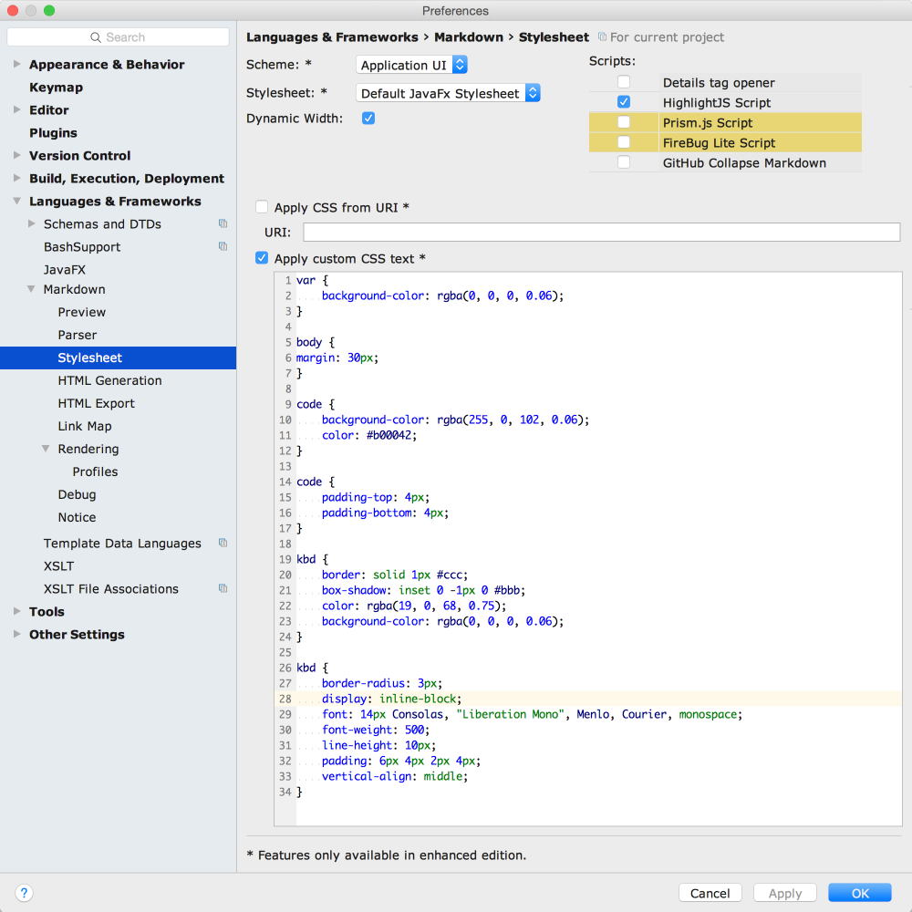
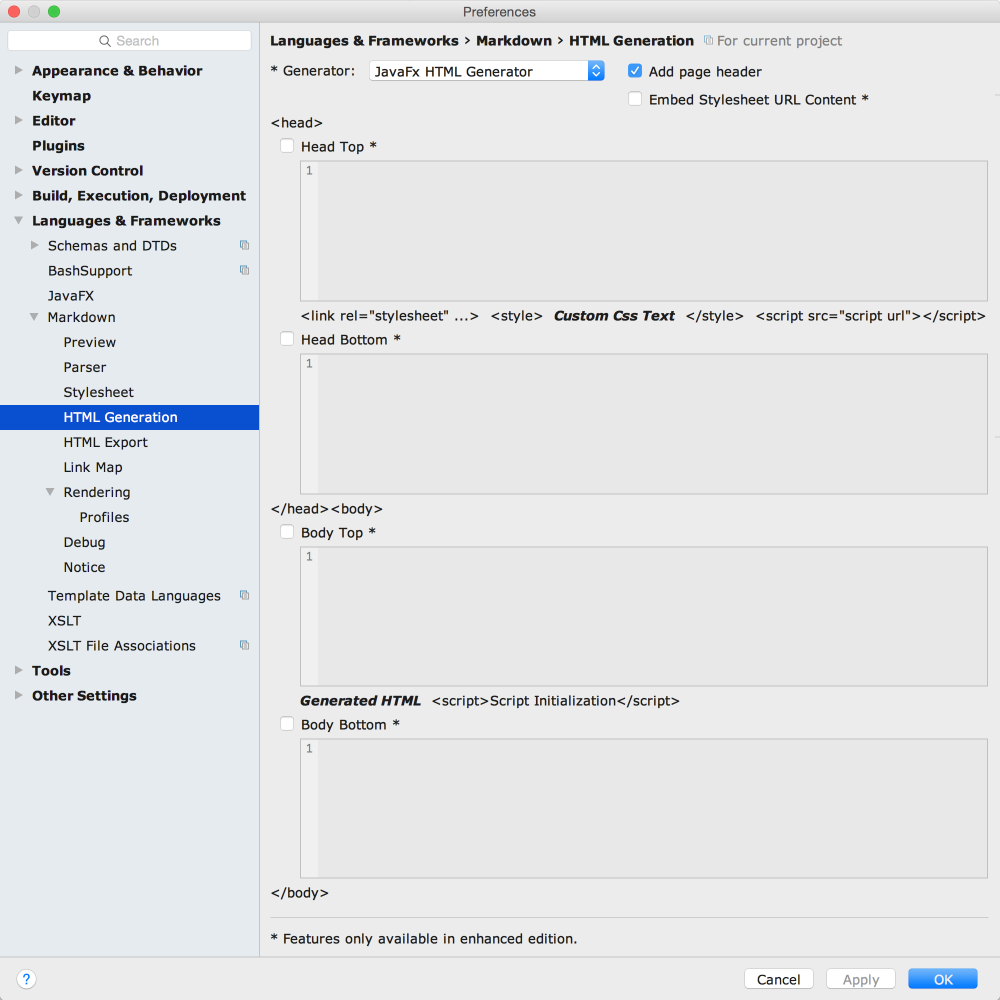
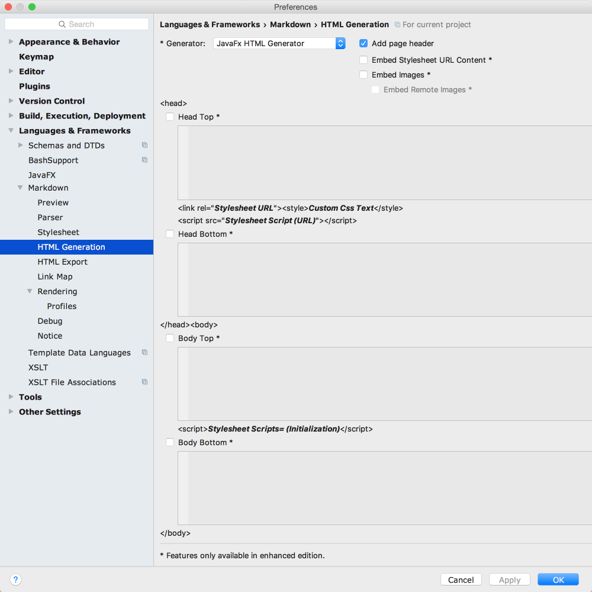
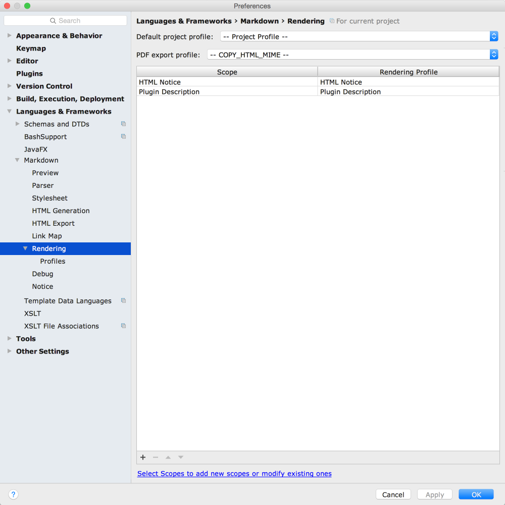

 Markdown Navigator 2.0
==========================================================================================================================================================

[TOC levels=2,3]: # "Table of Contents"

### Table of Contents
- [Overview](#overview)
    - [Document with pleasure!](#document-with-pleasure)
    - [Two tier model](#two-tier-model)
- [Release Road Map](#release-road-map)
    - [Next Release: Version 2.3.5](#next-release-version-235)
    - [Version 2.3.4](#version-234)
    - [Version 2.3.3](#version-233)
    - [Version 2.3.2](#version-232)
    - [Version 2.3.1](#version-231)
    - [Version 2.3.0](#version-230)
    - [Version 2.2.0](#version-220)
    - [Version 2.1.1](#version-211)
    - [Version 2.1.0](#version-210)
    - [Source Update is Long Overdue](#source-update-is-long-overdue)
- [Older Versions](#older-versions)
    - [Version 1.8.4](#version-184)
- [Rogues Gallery of Features](#rogues-gallery-of-features)
    - [Screenshots](#screenshots)
- [Background](#background)

## Overview

**[Markdown][Markdown] language support for IntelliJ
platform**

**A Markdown plugin** with GFM and a **matching** preview style.

**Get Markdown Navigator [enhanced edition][Markdown Navigator] to unlock all productivity
features.**

### Document with pleasure!

Work with [Markdown] files like you do with other languages in the IDE, by getting full support
for:

* **Paste images** into documents for fast screen capture links
* **Drag & Drop files and images** for fast link insertion
* **Formatting** to cleanup documents with a key stroke
* **Navigation and Find Usages** to find references without effort
* **Copy Markdown** as **JIRA**, **YouTrack** or **HTML** formatted text
* Convert **HTML to Markdown by pasting** it into a Markdown document.
* **Export** to **HTML** or **PDF** to share with others
* **Refactoring** of all referencing elements:
  * files ⟺ links
  * headings ⟺ ref anchors
  * footnotes ⟺ footnote refs
  * references ⟺ ref links/ref images
* **Completions** to reduce typing:
  * link address ⇐ files
  * ref anchors ⇐ headings
  * footnote refs ⇐ footnotes
  * ref links/ref images ⇐ references
  * link text ⇐ ref anchor/link address
* **Error and Warning** annotations to help catch mistakes early
* **Intention actions** for fast results with less effort
* **Wrap on Typing** to keep it nicely formatted as you edit
* **GitHub style rendering** that you are used to, out of the box
* **Fast typing response** for distraction free editing
* **Fully customizable** to adjust to your preferences and project needs

### Two tier model

1. Previewing and syntax highlighting functionality with a split editor is available in the
   Basic open source edition. Intended for mostly previewing markdown documents and unaided
   editing. Wiki link refactoring and completions are also available in the basic edition to
   ease the task of wiki maintenance.

2. Advanced features used for creating and maintaining markdown documents: refactoring, find
   usages, validation, auto formatting and HTML page customizations are only available in the
   Enhanced licensed version. 15-day free trial licenses are available from [Markdown Navigator]
   page on my website.

Release Road Map
----------------

### Next Release: Version 2.3.5

Bug and compatibility fixes you can find in [Version Notes].

* File Drop/Paste operation options based on caret location
  
* `Copy Modified Image to Clipboard` in Copy/Paste Image Dialog to replace clipboard image
  contents with modified image, can use it to replace image on clipboard then Cancel dialog to
  not modify the Markdown document but still have the modified image on the clipboard.

  
* Copy/Modify Image intention that will open the Image Copy/Paste Dialog for the image
  content of the image link element at caret position. Works with local files and URLs. Get the
  option to change directory, file name and modify the image.
* Markdown application settings for:
  * `Use clipboard text/html content when available` disabled by default, enabling it will allow
    pasting text/html when available
  * `Convert HTML content to Markdown` enabled by default, disabling will paste text/html
    content without conversion to Markdown

  
* Option highlight selection in preview, `Show source selection in preview` enabled by default.
  Wraps selection in `` with `selection-highlight` class.

* Option to highlight search results in preview, `Show source search highlights in preview`
  enabled by default. Wraps search highlights in `` with `search-highlight` class.

* Option to vertically align synchronized position in Preview Settings, selected by default
  in Preview settings.

### Version 2.3.4

* Add: link format option to Paste Images & Copy Images
  * Page Relative
  * Repo Relative (`/...`)
  * Absolute (`http://`)
  * Absolute (`file://`)
* Add: File drag and drop into markdown document to create links, image files create image links
  the rest create inline links. Each file link will be added as a separately undoable command.

  If copy dragging files (Ctrl on Linux/Windows, ⌥ on OS X) then for image files the `Copy
  Image` dialog will open (like Paste Image dialog) that will allow you to modify the image and
  choose the location where to store the copy.

  For non-image files a link format dialog is displayed for the first file to allow selecting
  the link format.

### Version 2.3.3

* Paste Images from clipboard directly into Markdown documents to inserts an image link or
  update links and save PNG image file thanks image utils library from
  [holgerbrandl/pasteimages]
  * caret context ops: insert image link, replace link, replace link target, replace image file
    content
  * image processing options with preview:
    * crop left, right, top, bottom settings
    * scale image 10% to 200% with interpolation options:nearest neighbour, bilinear, bicubic
    * change color (with margin of tolerance) to transparent
    * round corners with corner radius setting
    * add border with border width option
* PDF export action, menu and toolbar item added
* GitHub Collapse Markdown script, which converts headings in the document to collapsible
  sections in preview, with state persistence for initializing the open/close state of headings.
  Now collapsed heading are preserved between page refreshes and when opening markdown files.

### Version 2.3.2

* Fix: bugs in HTML to Markdown converter

* Fix: bugs in Markdown formatting

* Fix: bugs in Copy Markdown as HTML mime content

### Version 2.3.1

This release adds HTML to Markdown conversion capability allowing you to Copy HTML from the
browser and get Markdown when you paste it in your Markdown document.

* Conversion between HTML and Markdown
  * Automatic mime `text/html` conversion to markdown on paste in Markdown documents.
  * Markdown To Html intention action to convert some markdown elements to HTML in your document
    so they can be rendered on processors that do not support these Markdown extensions:
    * Tables
    * Image Links (Multi-line URL images for inserting UML, LaTex, etc)
    * Definitions List
  * Html to Markdown intention action to convert html in Markdown

* Annotations and Quick Fixes:
  * for TOC with empty title string. GitHub does not accept this so an empty title needs at
    least one space in the title string of the TOC element.
  * for list items that need a blank line before them or empty items that need a space after
    them to be processed by target markdown processor.

* Jekyll Support:
  * include Jekyll tag parsing and processing the include, if markdown will be parsed to HTML
    and rendered in the view, if not markdown will be included in the HTML
    * Markdown referenceable elements such as footnotes, references and headings from files
      included through Jekyll include tags are now recognized for: find usages, completions,
      navigation and refactoring.
  * enable parsing of jekyll macros in urls with spaces between braces when Jekyll Front matter
    parsing.

* Escape/Unescape `Special Characters` when these wrap to start of line or unescape them when
  they are wrapped away from the start of line. This prevents accidental lists, heading and
  definition lists. Code style options:
  * `Escape when wrapped to start of line`
  * `Unescape when wrapped away from start of line`

### Version 2.3.0

* Now list processing option can be set to one of the following:
  * GitHub: [Markdown], GitHub and GitBook documents, GitHub Wiki Pages
  * CommonMark: [CommonMark] and GitHub Comments
  * Fixed 4 Indent: [MultiMarkdown], [pegdown], [pandoc].

  :warning: Changing the list processing option can change the formatting of the document since
  element indentation will be interpreted differently.

* Format element, document and list indent/un-indent actions respect the list processing
  configuration.

* Actions to navigate and select table cells added with permutations of next/prev table
  cell/cell-start/cell-end with/without selection. Assign to shortcuts in Keymap > Plug-ins >
  Markdown Navigator

* Code Style option to sort task items based on their done/not done status:
  * `No Change`: leave all as is
  * `Incomplete first`: put incomplete tasks first, followed by the rest
  * `Has incomplete first`: put incomplete tasks and list items that contain incomplete tasks
    first followed by the rest
  * `Incomplete first, complete to non-task`: put incomplete tasks first, followed by the rest
    and convert complete tasks to non-task items.
  * `Has incomplete, complete to non-task`: put incomplete tasks and list items that contain
    incomplete tasks first followed by the rest and convert complete tasks to non-task items.

* Code Style options for Table of Contents to control generated TOC format and new style
  keywords in the `[TOC]` element:
  * `hierarchy`: as before hierarchical list of headings in document order
  * `flat`: flat list of headings in document order
  * `reversed`: flat reversed list of headings in reverse document order
  * `increasing`: flat, alphabetically increasing by heading text
  * `decreasing`: flat, alphabetically decreasing by heading text

* Inline toggling actions take punctuation characters that they will not wrap by default if
  caret is on them or the current word to wrap ends on them. Default punctuation symbols in
  settings: `.,;:!?`. If the caret is right after one of them then default behavior is to wrap
  the word immediately before the punctuation characters in the corresponding style.

* `@formatter:off` / `@formatter:on`, or configured Code Style: Formatter Control Markers, in
  comments can be used to disable auto-formatting and wrap on typing for sections of a document

* `Copy Markdown as HTML formatted text` action that will copy document or selection to the
  clipboard in HTML mime format that will paste as formatted HTML into applications that
  recognize this format. Useful for pasting rendered markdown into e-mails or word processor
  applications. To override the default styles and parser options create a profile named
  `COPY_HTML_MIME` and override `Parser` and/or `Stylesheet` CSS Text. See:
  [Copy Markdown to HTML formatted text]

* Option in Main Settings `Inline code toggle like other text style actions` to change inline
  code action to work like other style toggle actions: bold, italic and strike through, instead
  of continuously adding back ticks when at the end of word. Enabled by default. To get previous
  behavior disable this option.

* Add: Parser extensions and options for:
  * Ins: `++inserted text++` results in underlined text
  * Subscript: `~subscript~`
  * Superscript: `^superscript^`

### Version 2.2.0

The goal of zero latency typing in 1000+ line files with preview showing is now a reality. This
release is a rewrite of JavaFX WebView integration code with changes to the style sheet to
eliminate all typing response typing delays.

It is now possible, should you need it, to edit a 500k file with 11,000+ lines with an easily
tolerable typing delay.

In addition to a long list of bug fixes you can find in [Version Notes], this release was a
major tie up of user feature requests:

* Basic version now with split editor and HTML text preview
* Live template for collapsible details 

under mnemonic `.collapsed`

  must first be enabled in <kbd>LiveTemplates > Markdown</kbd>. To keep all `detail` tags open
  after preview update, add JavaFX WebView script `Details tag opener` so the content can be
  seen while editing &nbsp;

* Option to hide disabled toolbar buttons makes better use of screen real-estate
* Display line numbers in fenced code by enabling `Prism.js` script in Stylesheet settings
* All markdown settings affecting rendering are now per project with support for scoped
  rendering profiles allowing different settings down to file level granularity to be defined
  for a project
* Multi-line URL image links are back since upgrade to [flexmark-java] parser
* Collapsible headers script adapted from [GitHub-userscripts] by Rob Garrison. Enable `GitHub
  Collapse Markdown` in Stylesheet settings
* HTML Export with optional auto-export on document save or project open, with Tools menu
  `Markdown Navigator` items and all the fixings for the generated HTML which can be different
  from ones used for rendering the document in preview
* Link pre and post processing replacements to allow refactoring, completion, validation and
  navigation for links decorated with non-github parameters, like Jekyll's macros. See:
  [Modifying Link Processing]
* Jekyll front matter pre and post processing replacements to allow refactoring, completion,
  validation and navigation for key values that contain file references. See:
  [Modifying Link Processing]
* Swing browser options now support embedding stylesheet contents into the HTML
* Swing browser now supports displaying HTML documents `Show Split Editor for HTML documents`
* Soft Wrap at right margin option with:
  * option to disable wrap on typing when soft wrap is enabled
  * option for document format when soft wrap is enabled:
    * disable format
    * leave enabled
    * infinite margins. This will effectively remove all soft breaks when formatting the
      document.
* Link text completion for GitHub issue titles now do issue title lookup
* `Copy Jira Formatted text` ![Copy Jira] action improved to add blank lines for loosely spaced
  lists and after the last list item of the outer-most list and the next element; and now adds
  `:lang=` for fenced code that specifies the language
* Move caret to line of element clicked in preview
* Scroll and optionally Highlight element in preview at source caret position
* Print HTML preview for JavaFx
* Markdown syntax and context aware trailing space trimming when enabled

### Version 2.1.1

All parsing and rendering is now done by the new parser. Performance and typing response is
simply amazing. For small files, about 100k and less than a thousand lines, you can set the
syntax highlighter to "Lexer". For larger files or when you want fastest typing response, then
syntax highlighter should be set to "Annotator", which is the default. For best typing response
in very large files, you can turn off the preview while editing.

* Add: Smart copy/paste between files
  * change relative links/references to reflect destination file's location
  * change relative links/references to absolute if relative format will cannot be resolved
  * append footnotes/references that are not included but are referenced in the copied text
* Add: Breadcrumbs support for markdown documents
* Add: Structure View elements now compatible with text search

### Version 2.1.0

* Add: GFM table rendering option to render tables text that GFM would render as text.
* Add: JavaFX preview scroll to source position
* Add: JavaFX highlight preview element at caret position, with detail down to source line
* Add: flexmark parser for all parsing and rendering.
* Some elements still missing but they are not supported by GFM:
  * Definitions
  * Typographic: Quotes, Smarts
  * Multi-Line Image URLs
* Add: Languages & Settings > Markdown > Debug settings for which parser is to be used for:
  lexer, parser, annotator and HTML renderer. Highly recommended these are all set to "flexmark"
  but if you want to compare or need pegdown parsing then set them to how it used to be, set one
  or all to pegdown.

  :warning: Pegdown version is no longer supported so you are on your own for any issues and
  problems caused by using pegdown parser. :smiling_imp: I couldn't wait to be able to say that.

### Source Update is Long Overdue

Now that I unified the display between the licensed and unlicensed versions by removing support
for preview tabs in favour of split editor as the only option, I will be updating the open
source with a new version much easier.

The update will be more like a replacement of the source than an evolution of it. The directory
structure has changed significantly and a lot of Java has been converted to Kotlin.

The enhanced version is now 120k lines of code so my goal is to separate the open source
functionality from the proprietary code with a clean boundary to make open source releases
synchronized with plugin releases like they used to be but without the need for manual merging
between the two.

#### Working with the source

Standard IntelliJ Plugin development environment.

#### Some internal details, should you care to know

The [pegdown][] [Markdown] parser used by the plugin in its original incarnation was changed to
[flexmark-java] and [pegdown] dependencies have been removed as of version 2.2.0.

[flexmark-java] is my fork of [commonmark-java], with changes:

* source element based AST with detailed break down of each element for syntax highlighting
* complete source position tracking for all elements and their lexical parts
* optimized for efficient parsing with many parser extensions installed
* unified core and extension options API to simplify parser/renderer configuration
* options to tweak core parser rules

In the process of making the needed modifications to the original [commonmark-java] parser,
performance was impacted by about 25-35%. This still makes the new parser **7x-10x** faster than
[intellij-markdown] parser used by [Markdown Support] and **25x-50x** faster than pegdown. As an
added benefit, the new parser does not suffer from pegdown's idiosyncrasies of exponential parse
times or pathological input cases that cause infinite loops in the parser's state machine.

On the coding end, the new parser is a joy to maintain and enhance. The parser architecture,
inherited from [commonmark-java], is easy to debug and test. Markdown element parsers have
little or no interdependencies with other element parsers making it easy to fine tune parser
behaviour on a per element basis and add parser configuration options to emulate other markdown
processors. All this is in contrast to pegdown's one big PEG grammar implementation with
everything potentially inter-dependent.

Older Versions
--------------

### Version 1.8.4

:warning: This is the last release using [pegdown] and compatible with JRE 1.6. Later releases
are based on the [flexmark-java] and require JRE 1.8.

* Project module names added to inline code completions

* More flexible inline code completions, will allow qualified class names and multi-class name
  matches when completing members. If more than one class name matches then the combined set of
  members is used from all matched classes.

* Inline code elements are now treated as literal so that classes, methods and fields can be
  refactored with search in strings.

  :warning: this only works if syntax highlighting is set to lexer not annotator. Lexer used
  when annotator syntax highlighting is selected only distinguishes html comments from plain
  text. The comments are needed to allow for TODO processing to work with either highlighter.

Rogues Gallery of Features
--------------------------

* JavaFX preview scroll to source with highlight element in preview

  

* **Table of Contents** tag that works with basic markdown syntax and is updated by the plugin.
  The table of contents at the top of this page is an example. For more information see the
  [wiki](../../wiki/Adding-a-Table-of-Contents#enabling-table-of-contents)

* Java class, method and field completions in inline code. Great if you need to reference code
  elements in your project from a markdown document.

* toolbar buttons and actions, see [Enhanced Features](../../wiki/Enhanced-Features)

  

* **Document Structure View** with sections for:
  * Headers to show header hierarchy by level
    
  * Images
  * Links
  * References
  * Tables
  * Footnotes
  * Abbreviations
  * Document section showing all abbreviations, block quotes, footnotes, headers, images, lists,
    references and tables in the document. According to markdown element hierarchy and in order
    of their location in the document.
    

* **Document format** toolbar button and action to format the document to code style settings.
  [Document Format Options](../../wiki/Document-Format-Options)

* Dynamically created syntax highlighting attributes to simulate overlay of element style with
  transparency. This creates consistent colors when multiple attributes are combined, such as
  inline elements in tables, headers and definition terms. Additionally allows for bold, italic,
  and effect type and color to be combined for nested markdown inline elements.
  

* Actual character display font width can be used for wrapping and table formatting, allowing
  best alignment for multi-byte characters and proportional fonts:

  With character width taken into account:
  

  Without taking character width into account:
  

* **Block Quote** increase/decrease level toolbar buttons and actions.

* **Emoji** support added to preview.

* Toolbar, Live Template and Table editing improved. See
  [Enhanced Features](../../wiki/Enhanced-Features).

### Screenshots

##### Create and edit a markdown table with ease:

##### Still Great GitHub Rendering Resemblance for your preview pleasure

##### Split your editor and see the preview as you type

##### Peek at the HTML

###### Change options, customize the syntax colors and CSS to your liking.

Background
----------

It all started with a desire to see Markdown files in PhpStorm IDE as they would look on GitHub.
I was already using [nicoulaj/idea-markdown plugin] but found its preview was more like
[Craig's List] than [GitHub]. It did not appear to have been recently updated, so I decided to
fork it and modify the style sheet it uses. How hard could that be?

I found out quickly that there was more to it than meets the eye. Rendering is done by Java not
a browser, the parser is HTML 3.1 and not all features are implemented. Additionally, the Table
extension did not work in the version of `pegdown` used by the plugin. I needed that because
maintaining HTML tables is a pain. So I upgraded the plugin to use the latest `pegdown`,
`parboiled` and fixed a few bugs. Since I was already in the code, I might as well add a few
more desired features like user editable style sheet, fix a few more bugs, add updates to
preview so that I could split the editor pane and edit in one while seeing the preview in the
other.

Then I encountered some bugs in parsing of compound nested lists in `pegdown` and had to dive
into its source to fix them. Having done that and gotten familiar with it, I decided to add a
new extension. Finally, to help me with debugging and generating test expectations for
`pegdown`, I had to have the HTML Text tab to display the generated HTML.

It has been a fun trip down the rabbit hole of IntelliJ IDEA plugin development that started
with a simple desire for a Markdown preview that looked like GitHub's.

---

\* This plugin was originally based on the [nicoulaj/idea-markdown plugin] by [nicoulaj], which
was based on [pegdown] library by [sirthias].

Markdown Navigator, Copyright (c) 2015-2017, V. Schneider, <http://vladsch.com> All Rights
Reserved.

[CommonMark]: http://commonmark.org/
[commonmark-java]: https://github.com/atlassian/commonmark-java
[Copy Jira]: https://github.com/vsch/idea-multimarkdown/raw/master/resources/icons/editor_actions/Copy_jira.png
[Copy Markdown to HTML formatted text]: https://github.com/vsch/idea-multimarkdown/wiki/Enhanced-Features#copy-markdown-to-html-formatted-text
[Craig's List]: http://montreal.en.craigslist.ca/
[flexmark-java]: https://github.com/vsch/flexmark-java
[GitHub]: https://github.com/vsch/laravel-translation-manager
[GitHub-userscripts]: https://github.com/Mottie/GitHub-userscripts
[holgerbrandl/pasteimages]: https://github.com/holgerbrandl/pasteimages
[intellij-markdown]: https://github.com/valich/intellij-markdown
[Markdown]: http://daringfireball.net/projects/markdown
[Markdown Navigator]: http://vladsch.com/product/markdown-navigator
[Markdown Support]: https://plugins.jetbrains.com/plugin/7793?pr=
[Modifying Link Processing]: https://github.com/vsch/idea-multimarkdown/wiki/Modifying-Link-Processing
[MultiMarkdown]: http://fletcherpenney.net/multimarkdown/
[nicoulaj]: https://github.com/nicoulaj
[nicoulaj/idea-markdown plugin]: https://github.com/nicoulaj/idea-markdown
[Pandoc]: http://pandoc.org/MANUAL.html#pandocs-markdown
[pegdown]: http://pegdown.org
[sirthias]: https://github.com/sirthias
[Version Notes]: https://github.com/vsch/idea-multimarkdown/blob/master/resources/META-INF/VERSION.md
[.gitignore]: http://hsz.mobi
[Android Studio]: http://developer.android.com/sdk/installing/studio.html
[AppCode]: http://www.jetbrains.com/objc
[CLion]: https://www.jetbrains.com/clion
[DataGrip]: https://www.jetbrains.com/datagrip
[GitHub Issues]: https://github.com/vsch/idea-multimarkdown/issues
[GitHub Issues page]: https://github.com/vsch/idea-multimarkdown/issues/
[GitHub wiki in IntelliJ IDE]: https://github.com/vsch/idea-multimarkdown/wiki/Adding-GitHub-Wiki-to-IntelliJ-Project
[GitHub Wiki pages]: https://github.com/vsch/idea-multimarkdown/wiki
[IntelliJ IDEA]: http://www.jetbrains.com/idea
[Jekyll]: https://jekyllrb.com
[JetBrains plugin comment and rate page]: https://plugins.jetbrains.com/plugin/writeComment?pr=&pluginId=7896
[JetBrains plugin page]: https://plugins.jetbrains.com/plugin?pr=&pluginId=7896
[Kotlin]: http://kotlinlang.org
[Kramdown]: http://kramdown.gettalong.org/
[PhpExtra]: https://michelf.ca/projects/php-markdown/extra/
[PhpStorm]: http://www.jetbrains.com/phpstorm
[Pipe Table Formatter]: https://github.com/anton-dev-ua/PipeTableFormatter
[PyCharm]: http://www.jetbrains.com/pycharm
[RubyMine]: http://www.jetbrains.com/ruby
[sirthias/pegdown]: https://github.com/sirthias/pegdown
[vsch/pegdown]: https://github.com/vsch/pegdown/tree/develop
[WebStorm]: http://www.jetbrains.com/webstorm
[Wiki]: https://github.com/vsch/idea-multimarkdown/wiki

